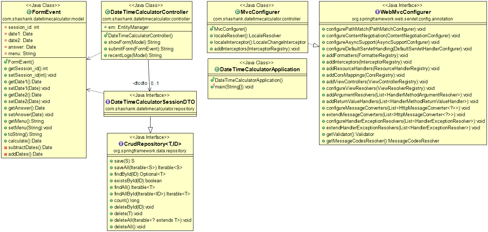
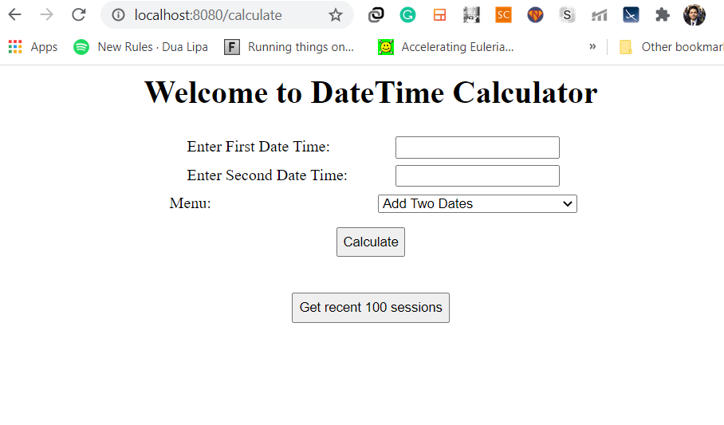
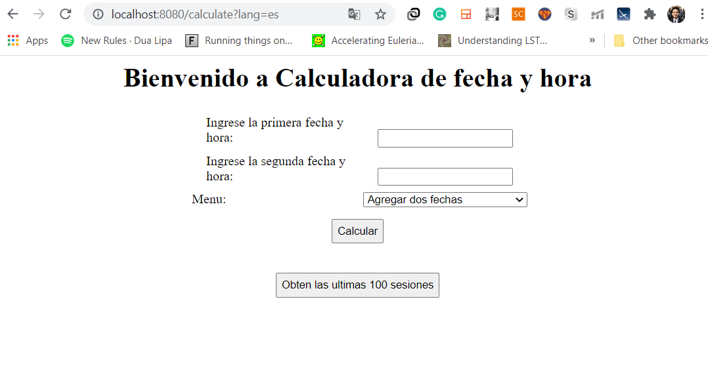
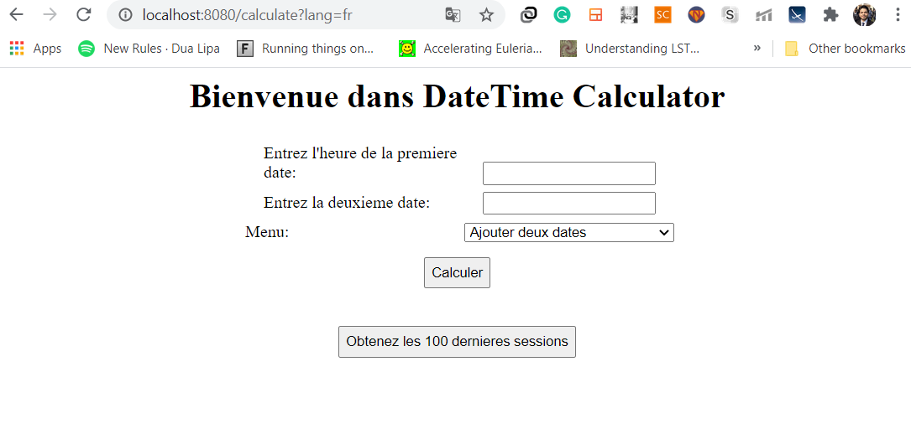
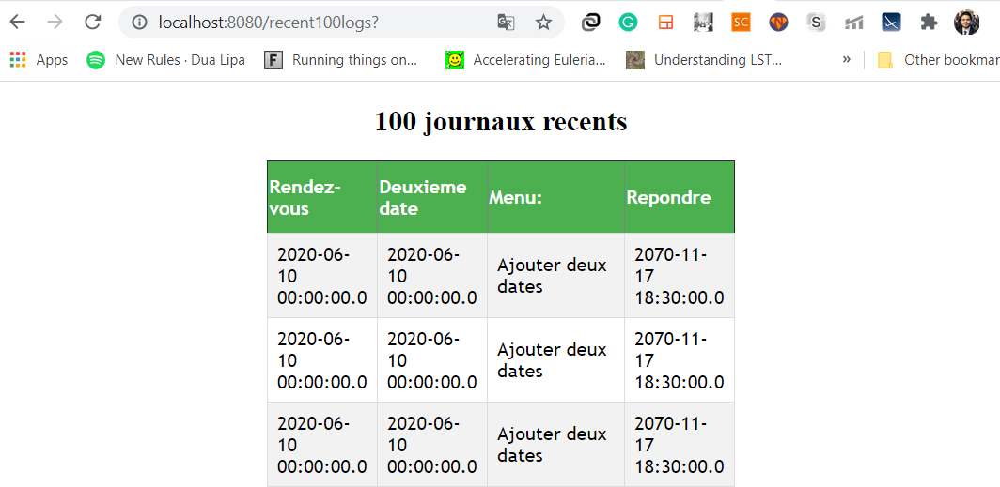

# Date Time Calculator (Week 2 Java)

[](https://travis-ci.org/joemccann/dillinger)

languages support:
  - English
  - French
  - Spanish
  
# Diagrams
## Class diagram


# UI
## API for English
```sh
http://127.0.0.1:8080/calculate
```


## API for Spanish
```sh
http://127.0.0.1:8080/calculate?lang=es
```


## API for French
```sh
http://127.0.0.1:8080/calculate?lang=fr
```


## Getting 100 recent logs
```sh
http://127.0.0.1:8080/recent100logs?lang=<lang>
```


## API 2 for generating processing fee report
```sh
http://127.0.0.1:8080/generateReport/csv
```


## Logging of API requests

# Import this maven repo to workspace and then run
## command 1
```sh
mvn clean install
```
### Output
```console
[INFO] Scanning for projects...
[INFO]
[INFO] --------------------< com.shashank:incomeevaluator >--------------------
[INFO] Building incomeevaluator 0.0.1-SNAPSHOT
[INFO] --------------------------------[ jar ]---------------------------------
[INFO]
[INFO] --- maven-clean-plugin:3.1.0:clean (default-clean) @ incomeevaluator ---
[INFO] Deleting C:\Users\STARK\eclipse-workspace2\datetimecalculator\target
[INFO]
[INFO] --- maven-resources-plugin:3.2.0:resources (default-resources) @ incomeevaluator ---
[INFO] Using 'UTF-8' encoding to copy filtered resources.
[INFO] Using 'UTF-8' encoding to copy filtered properties files.
[INFO] Copying 1 resource
[INFO] Copying 8 resources
[INFO] The encoding used to copy filtered properties files have not been set. This means that the same encoding will be used to copy filtered properties files as when copying other filtered resources. This might not be what you want! Run your build with --debug to see which files might be affected. Read more at https://maven.apache.org/plugins/maven-resources-plugin/examples/filtering-properties-files.html
[INFO]
[INFO] --- maven-compiler-plugin:3.2:compile (default-compile) @ incomeevaluator ---
[INFO] Changes detected - recompiling the module!
[INFO] Compiling 5 source files to C:\Users\STARK\eclipse-workspace2\datetimecalculator\target\classes
[INFO]
[INFO] --- maven-resources-plugin:3.2.0:testResources (default-testResources) @ incomeevaluator ---
[INFO] Using 'UTF-8' encoding to copy filtered resources.
[INFO] Using 'UTF-8' encoding to copy filtered properties files.
[INFO] skip non existing resourceDirectory C:\Users\STARK\eclipse-workspace2\datetimecalculator\src\test\resources
[INFO]
[INFO] --- maven-compiler-plugin:3.2:testCompile (default-testCompile) @ incomeevaluator ---
[INFO] Changes detected - recompiling the module!
[INFO] Compiling 1 source file to C:\Users\STARK\eclipse-workspace2\datetimecalculator\target\test-classes
[INFO]
[INFO] --- maven-surefire-plugin:2.22.2:test (default-test) @ incomeevaluator ---
[INFO]
[INFO] -------------------------------------------------------
[INFO]  T E S T S
[INFO] -------------------------------------------------------
[INFO] Running com.shashank.datetimecalculator.DateTimeCalculatorTests
21:04:18.193 [main] DEBUG org.springframework.test.context.BootstrapUtils - Instantiating CacheAwareContextLoaderDelegate from class [org.springframework.test.context.cache.DefaultCacheAwareContextLoaderDelegate]
21:04:18.216 [main] DEBUG org.springframework.test.context.BootstrapUtils - Instantiating BootstrapContext using constructor [public org.springframework.test.context.support.DefaultBootstrapContext(java.lang.Class,org.springframework.test.context.CacheAwareContextLoaderDelegate)]
21:04:18.255 [main] DEBUG org.springframework.test.context.BootstrapUtils - Instantiating TestContextBootstrapper for test class [com.shashank.datetimecalculator.DateTimeCalculatorTests] from class [org.springframework.boot.test.context.SpringBootTestContextBootstrapper]
21:04:18.274 [main] INFO org.springframework.boot.test.context.SpringBootTestContextBootstrapper - Neither @ContextConfiguration nor @ContextHierarchy found for test class [com.shashank.datetimecalculator.DateTimeCalculatorTests], using SpringBootContextLoader
21:04:18.284 [main] DEBUG org.springframework.test.context.support.AbstractContextLoader - Did not detect default resource location for test class [com.shashank.datetimecalculator.DateTimeCalculatorTests]: class path resource [com/shashank/datetimecalculator/DateTimeCalculatorTests-context.xml] does not exist
21:04:18.285 [main] DEBUG org.springframework.test.context.support.AbstractContextLoader - Did not detect default resource location for test class [com.shashank.datetimecalculator.DateTimeCalculatorTests]: class path resource [com/shashank/datetimecalculator/DateTimeCalculatorTestsContext.groovy] does not exist
21:04:18.285 [main] INFO org.springframework.test.context.support.AbstractContextLoader - Could not detect default resource locations for test class [com.shashank.datetimecalculator.DateTimeCalculatorTests]: no resource found for suffixes {-context.xml, Context.groovy}.
21:04:18.286 [main] INFO org.springframework.test.context.support.AnnotationConfigContextLoaderUtils - Could not detect default configuration classes for test class [com.shashank.datetimecalculator.DateTimeCalculatorTests]: DateTimeCalculatorTests does not declare any static, non-private, non-final, nested classes annotated with @Configuration.
21:04:18.355 [main] DEBUG org.springframework.test.context.support.ActiveProfilesUtils - Could not find an 'annotation declaring class' for annotation type [org.springframework.test.context.ActiveProfiles] and class [com.shashank.datetimecalculator.DateTimeCalculatorTests]
21:04:18.465 [main] DEBUG org.springframework.context.annotation.ClassPathScanningCandidateComponentProvider - Identified candidate component class: file [C:\Users\STARK\eclipse-workspace2\datetimecalculator\target\classes\com\shashank\datetimecalculator\DateTimeCalculatorApplication.class]
21:04:18.466 [main] INFO org.springframework.boot.test.context.SpringBootTestContextBootstrapper - Found @SpringBootConfiguration com.shashank.datetimecalculator.DateTimeCalculatorApplication for test class com.shashank.datetimecalculator.DateTimeCalculatorTests
21:04:18.643 [main] DEBUG org.springframework.boot.test.context.SpringBootTestContextBootstrapper - @TestExecutionListeners is not present for class [com.shashank.datetimecalculator.DateTimeCalculatorTests]: using defaults.
21:04:18.643 [main] INFO org.springframework.boot.test.context.SpringBootTestContextBootstrapper - Loaded default TestExecutionListener class names from location [META-INF/spring.factories]: [org.springframework.boot.test.mock.mockito.MockitoTestExecutionListener, org.springframework.boot.test.mock.mockito.ResetMocksTestExecutionListener, org.springframework.boot.test.autoconfigure.restdocs.RestDocsTestExecutionListener, org.springframework.boot.test.autoconfigure.web.client.MockRestServiceServerResetTestExecutionListener, org.springframework.boot.test.autoconfigure.web.servlet.MockMvcPrintOnlyOnFailureTestExecutionListener, org.springframework.boot.test.autoconfigure.web.servlet.WebDriverTestExecutionListener, org.springframework.boot.test.autoconfigure.webservices.client.MockWebServiceServerTestExecutionListener, org.springframework.test.context.web.ServletTestExecutionListener, org.springframework.test.context.support.DirtiesContextBeforeModesTestExecutionListener, org.springframework.test.context.support.DependencyInjectionTestExecutionListener, org.springframework.test.context.support.DirtiesContextTestExecutionListener, org.springframework.test.context.transaction.TransactionalTestExecutionListener, org.springframework.test.context.jdbc.SqlScriptsTestExecutionListener, org.springframework.test.context.event.EventPublishingTestExecutionListener]
21:04:18.668 [main] INFO org.springframework.boot.test.context.SpringBootTestContextBootstrapper - Using TestExecutionListeners: [org.springframework.test.context.web.ServletTestExecutionListener@7c214cc0, org.springframework.test.context.support.DirtiesContextBeforeModesTestExecutionListener@5b67bb7e, org.springframework.boot.test.mock.mockito.MockitoTestExecutionListener@609db546, org.springframework.boot.test.autoconfigure.SpringBootDependencyInjectionTestExecutionListener@20f5281c, org.springframework.test.context.support.DirtiesContextTestExecutionListener@56c4278e, org.springframework.test.context.transaction.TransactionalTestExecutionListener@301eda63, org.springframework.test.context.jdbc.SqlScriptsTestExecutionListener@3d246ea3, org.springframework.test.context.event.EventPublishingTestExecutionListener@341814d3, org.springframework.boot.test.mock.mockito.ResetMocksTestExecutionListener@4397ad89, org.springframework.boot.test.autoconfigure.restdocs.RestDocsTestExecutionListener@59cba5a, org.springframework.boot.test.autoconfigure.web.client.MockRestServiceServerResetTestExecutionListener@1bd39d3c, org.springframework.boot.test.autoconfigure.web.servlet.MockMvcPrintOnlyOnFailureTestExecutionListener@6f19ac19, org.springframework.boot.test.autoconfigure.web.servlet.WebDriverTestExecutionListener@119cbf96, org.springframework.boot.test.autoconfigure.webservices.client.MockWebServiceServerTestExecutionListener@71329995]
21:04:18.673 [main] DEBUG org.springframework.test.context.support.AbstractDirtiesContextTestExecutionListener - Before test class: context [DefaultTestContext@73302995 testClass = DateTimeCalculatorTests, testInstance = [null], testMethod = [null], testException = [null], mergedContextConfiguration = [WebMergedContextConfiguration@1838ccb8 testClass = DateTimeCalculatorTests, locations = '{}', classes = '{class com.shashank.datetimecalculator.DateTimeCalculatorApplication}', contextInitializerClasses = '[]', activeProfiles = '{}', propertySourceLocations = '{}', propertySourceProperties = '{org.springframework.boot.test.context.SpringBootTestContextBootstrapper=true}', contextCustomizers = set[org.springframework.boot.test.context.filter.ExcludeFilterContextCustomizer@378542de, org.springframework.boot.test.json.DuplicateJsonObjectContextCustomizerFactory$DuplicateJsonObjectContextCustomizer@11bd0f3b, org.springframework.boot.test.mock.mockito.MockitoContextCustomizer@0, org.springframework.boot.test.web.client.TestRestTemplateContextCustomizer@6631f5ca, org.springframework.boot.test.autoconfigure.actuate.metrics.MetricsExportContextCustomizerFactory$DisableMetricExportContextCustomizer@1a4013, org.springframework.boot.test.autoconfigure.properties.PropertyMappingContextCustomizer@0, org.springframework.boot.test.autoconfigure.web.servlet.WebDriverContextCustomizerFactory$Customizer@7ea9e1e2, org.springframework.boot.test.context.SpringBootTestArgs@1], resourceBasePath = 'src/main/webapp', contextLoader = 'org.springframework.boot.test.context.SpringBootContextLoader', parent = [null]], attributes = map['org.springframework.test.context.web.ServletTestExecutionListener.activateListener' -> true]], class annotated with @DirtiesContext [false] with mode [null].
21:04:18.737 [main] DEBUG org.springframework.test.context.support.TestPropertySourceUtils - Adding inlined properties to environment: {spring.jmx.enabled=false, org.springframework.boot.test.context.SpringBootTestContextBootstrapper=true}

  .   ____          _            __ _ _
 /\\ / ___'_ __ _ _(_)_ __  __ _ \ \ \ \
( ( )\___ | '_ | '_| | '_ \/ _` | \ \ \ \
 \\/  ___)| |_)| | | | | || (_| |  ) ) ) )
  '  |____| .__|_| |_|_| |_\__, | / / / /
 =========|_|==============|___/=/_/_/_/
 :: Spring Boot ::       (v2.4.0-SNAPSHOT)

2020-09-01 21:04:19.220  INFO 25416 --- [           main] c.s.d.DateTimeCalculatorTests            : Starting DateTimeCalculatorTests using Java 14 on MSI with PID 25416 (started by STARK in C:\Users\STARK\eclipse-workspace2\datetimecalculator)
2020-09-01 21:04:19.224  INFO 25416 --- [           main] c.s.d.DateTimeCalculatorTests            : No active profile set, falling back to default profiles: default
2020-09-01 21:04:20.394  INFO 25416 --- [           main] .s.d.r.c.RepositoryConfigurationDelegate : Bootstrapping Spring Data JPA repositories in DEFERRED mode.
2020-09-01 21:04:20.462  INFO 25416 --- [           main] .s.d.r.c.RepositoryConfigurationDelegate : Finished Spring Data repository scanning in 57 ms. Found 1 JPA repository interfaces.
2020-09-01 21:04:21.204  INFO 25416 --- [           main] o.s.s.concurrent.ThreadPoolTaskExecutor  : Initializing ExecutorService 'applicationTaskExecutor'
2020-09-01 21:04:21.458  INFO 25416 --- [         task-1] o.hibernate.jpa.internal.util.LogHelper  : HHH000204: Processing PersistenceUnitInfo [name: default]
2020-09-01 21:04:21.577  INFO 25416 --- [         task-1] org.hibernate.Version                    : HHH000412: Hibernate ORM core version 5.4.20.Final
2020-09-01 21:04:21.854  INFO 25416 --- [         task-1] o.hibernate.annotations.common.Version   : HCANN000001: Hibernate Commons Annotations {5.1.0.Final}
2020-09-01 21:04:22.033  WARN 25416 --- [           main] JpaBaseConfiguration$JpaWebConfiguration : spring.jpa.open-in-view is enabled by default. Therefore, database queries may be performed during view rendering. Explicitly configure spring.jpa.open-in-view to disable this warning
2020-09-01 21:04:22.123  INFO 25416 --- [         task-1] com.zaxxer.hikari.HikariDataSource       : HikariPool-1 - Starting...
2020-09-01 21:04:22.530  INFO 25416 --- [         task-1] com.zaxxer.hikari.HikariDataSource       : HikariPool-1 - Start completed.
2020-09-01 21:04:22.565  INFO 25416 --- [         task-1] org.hibernate.dialect.Dialect            : HHH000400: Using dialect: org.hibernate.dialect.PostgreSQLDialect
2020-09-01 21:04:23.201  INFO 25416 --- [           main] DeferredRepositoryInitializationListener : Triggering deferred initialization of Spring Data repositories?
2020-09-01 21:04:24.084  INFO 25416 --- [         task-1] o.h.e.t.j.p.i.JtaPlatformInitiator       : HHH000490: Using JtaPlatform implementation: [org.hibernate.engine.transaction.jta.platform.internal.NoJtaPlatform]
2020-09-01 21:04:24.096  INFO 25416 --- [         task-1] j.LocalContainerEntityManagerFactoryBean : Initialized JPA EntityManagerFactory for persistence unit 'default'
2020-09-01 21:04:24.335  INFO 25416 --- [           main] DeferredRepositoryInitializationListener : Spring Data repositories initialized!
2020-09-01 21:04:24.346  INFO 25416 --- [           main] c.s.d.DateTimeCalculatorTests            : Started DateTimeCalculatorTests in 5.598 seconds (JVM running for 6.941)
[INFO] Tests run: 1, Failures: 0, Errors: 0, Skipped: 0, Time elapsed: 6.483 s - in com.shashank.datetimecalculator.DateTimeCalculatorTests
2020-09-01 21:04:24.612  INFO 25416 --- [extShutdownHook] j.LocalContainerEntityManagerFactoryBean : Closing JPA EntityManagerFactory for persistence unit 'default'
2020-09-01 21:04:24.616  INFO 25416 --- [extShutdownHook] o.s.s.concurrent.ThreadPoolTaskExecutor  : Shutting down ExecutorService 'applicationTaskExecutor'
2020-09-01 21:04:24.616  INFO 25416 --- [extShutdownHook] com.zaxxer.hikari.HikariDataSource       : HikariPool-1 - Shutdown initiated...
2020-09-01 21:04:24.627  INFO 25416 --- [extShutdownHook] com.zaxxer.hikari.HikariDataSource       : HikariPool-1 - Shutdown completed.
[INFO]
[INFO] Results:
[INFO]
[INFO] Tests run: 1, Failures: 0, Errors: 0, Skipped: 0
[INFO]
[INFO]
[INFO] --- maven-jar-plugin:3.2.0:jar (default-jar) @ incomeevaluator ---
[INFO] Building jar: C:\Users\STARK\eclipse-workspace2\datetimecalculator\target\incomeevaluator-0.0.1-SNAPSHOT.jar
[INFO]
[INFO] --- spring-boot-maven-plugin:2.4.0-SNAPSHOT:repackage (repackage) @ incomeevaluator ---
[INFO] Replacing main artifact with repackaged archive
[INFO]
[INFO] --- maven-install-plugin:2.5.2:install (default-install) @ incomeevaluator ---
[INFO] Installing C:\Users\STARK\eclipse-workspace2\datetimecalculator\target\incomeevaluator-0.0.1-SNAPSHOT.jar to C:\Users\STARK\.m2\repository\com\shashank\incomeevaluator\0.0.1-SNAPSHOT\incomeevaluator-0.0.1-SNAPSHOT.jar
[INFO] Installing C:\Users\STARK\eclipse-workspace2\datetimecalculator\pom.xml to C:\Users\STARK\.m2\repository\com\shashank\incomeevaluator\0.0.1-SNAPSHOT\incomeevaluator-0.0.1-SNAPSHOT.pom
[INFO] ------------------------------------------------------------------------
[INFO] BUILD SUCCESS
[INFO] ------------------------------------------------------------------------
[INFO] Total time:  20.732 s
[INFO] Finished at: 2020-09-01T21:04:29+05:30
[INFO] ------------------------------------------------------------------------
```
## command 2
```sh
mvnw spring-boot:run
```
### Output
```console
[INFO] Scanning for projects...
[INFO]
[INFO] --------------------< com.shashank:incomeevaluator >--------------------
[INFO] Building incomeevaluator 0.0.1-SNAPSHOT
[INFO] --------------------------------[ jar ]---------------------------------
[INFO]
[INFO] >>> spring-boot-maven-plugin:2.4.0-SNAPSHOT:run (default-cli) > test-compile @ incomeevaluator >>>
[INFO]
[INFO] --- maven-resources-plugin:3.2.0:resources (default-resources) @ incomeevaluator ---
[INFO] Using 'UTF-8' encoding to copy filtered resources.
[INFO] Using 'UTF-8' encoding to copy filtered properties files.
[INFO] Copying 1 resource
[INFO] Copying 8 resources
[INFO] The encoding used to copy filtered properties files have not been set. This means that the same encoding will be used to copy filtered properties files as when copying other filtered resources. This might not be what you want! Run your build with --debug to see which files might be affected. Read more at https://maven.apache.org/plugins/maven-resources-plugin/examples/filtering-properties-files.html
[INFO]
[INFO] --- maven-compiler-plugin:3.2:compile (default-compile) @ incomeevaluator ---
[INFO] Nothing to compile - all classes are up to date
[INFO]
[INFO] --- maven-resources-plugin:3.2.0:testResources (default-testResources) @ incomeevaluator ---
[INFO] Using 'UTF-8' encoding to copy filtered resources.
[INFO] Using 'UTF-8' encoding to copy filtered properties files.
[INFO] skip non existing resourceDirectory C:\Users\STARK\eclipse-workspace2\datetimecalculator\src\test\resources
[INFO]
[INFO] --- maven-compiler-plugin:3.2:testCompile (default-testCompile) @ incomeevaluator ---
[INFO] Changes detected - recompiling the module!
[INFO] Compiling 1 source file to C:\Users\STARK\eclipse-workspace2\datetimecalculator\target\test-classes
[INFO]
[INFO] <<< spring-boot-maven-plugin:2.4.0-SNAPSHOT:run (default-cli) < test-compile @ incomeevaluator <<<
[INFO]
[INFO]
[INFO] --- spring-boot-maven-plugin:2.4.0-SNAPSHOT:run (default-cli) @ incomeevaluator ---
[INFO] Attaching agents: []

  .   ____          _            __ _ _
 /\\ / ___'_ __ _ _(_)_ __  __ _ \ \ \ \
( ( )\___ | '_ | '_| | '_ \/ _` | \ \ \ \
 \\/  ___)| |_)| | | | | || (_| |  ) ) ) )
  '  |____| .__|_| |_|_| |_\__, | / / / /
 =========|_|==============|___/=/_/_/_/
 :: Spring Boot ::       (v2.4.0-SNAPSHOT)

2020-09-01 21:06:09.416  INFO 24280 --- [  restartedMain] c.s.d.DateTimeCalculatorApplication      : Starting DateTimeCalculatorApplication using Java 14 on MSI with PID 24280 (C:\Users\STARK\eclipse-workspace2\datetimecalculator\target\classes started by STARK in C:\Users\STARK\eclipse-workspace2\datetimecalculator)
2020-09-01 21:06:09.421  INFO 24280 --- [  restartedMain] c.s.d.DateTimeCalculatorApplication      : No active profile set, falling back to default profiles: default
2020-09-01 21:06:09.484  INFO 24280 --- [  restartedMain] .e.DevToolsPropertyDefaultsPostProcessor : Devtools property defaults active! Set 'spring.devtools.add-properties' to 'false' to disable
2020-09-01 21:06:09.484  INFO 24280 --- [  restartedMain] .e.DevToolsPropertyDefaultsPostProcessor : For additional web related logging consider setting the 'logging.level.web' property to 'DEBUG'
2020-09-01 21:06:10.126  INFO 24280 --- [  restartedMain] .s.d.r.c.RepositoryConfigurationDelegate : Bootstrapping Spring Data JPA repositories in DEFERRED mode.
2020-09-01 21:06:10.189  INFO 24280 --- [  restartedMain] .s.d.r.c.RepositoryConfigurationDelegate : Finished Spring Data repository scanning in 49 ms. Found 1 JPA repository interfaces.
2020-09-01 21:06:10.903  INFO 24280 --- [  restartedMain] o.s.b.w.embedded.tomcat.TomcatWebServer  : Tomcat initialized with port(s): 8080 (http)
2020-09-01 21:06:10.919  INFO 24280 --- [  restartedMain] o.apache.catalina.core.StandardService   : Starting service [Tomcat]
2020-09-01 21:06:10.926  INFO 24280 --- [  restartedMain] org.apache.catalina.core.StandardEngine  : Starting Servlet engine: [Apache Tomcat/9.0.37]
2020-09-01 21:06:11.047  INFO 24280 --- [  restartedMain] o.a.c.c.C.[Tomcat].[localhost].[/]       : Initializing Spring embedded WebApplicationContext
2020-09-01 21:06:11.047  INFO 24280 --- [  restartedMain] w.s.c.ServletWebServerApplicationContext : Root WebApplicationContext: initialization completed in 1562 ms
2020-09-01 21:06:11.281  INFO 24280 --- [  restartedMain] o.s.s.concurrent.ThreadPoolTaskExecutor  : Initializing ExecutorService 'applicationTaskExecutor'
2020-09-01 21:06:11.346  INFO 24280 --- [         task-1] o.hibernate.jpa.internal.util.LogHelper  : HHH000204: Processing PersistenceUnitInfo [name: default]
2020-09-01 21:06:11.432  INFO 24280 --- [         task-1] org.hibernate.Version                    : HHH000412: Hibernate ORM core version 5.4.20.Final
2020-09-01 21:06:11.481  WARN 24280 --- [  restartedMain] JpaBaseConfiguration$JpaWebConfiguration : spring.jpa.open-in-view is enabled by default. Therefore, database queries may be performed during view rendering. Explicitly configure spring.jpa.open-in-view to disable this warning
2020-09-01 21:06:11.629  INFO 24280 --- [         task-1] o.hibernate.annotations.common.Version   : HCANN000001: Hibernate Commons Annotations {5.1.0.Final}
2020-09-01 21:06:11.744  INFO 24280 --- [         task-1] com.zaxxer.hikari.HikariDataSource       : HikariPool-1 - Starting...
2020-09-01 21:06:11.923  INFO 24280 --- [         task-1] com.zaxxer.hikari.HikariDataSource       : HikariPool-1 - Start completed.
2020-09-01 21:06:11.955  INFO 24280 --- [         task-1] org.hibernate.dialect.Dialect            : HHH000400: Using dialect: org.hibernate.dialect.PostgreSQLDialect
2020-09-01 21:06:12.099  INFO 24280 --- [  restartedMain] o.s.b.d.a.OptionalLiveReloadServer       : LiveReload server is running on port 35729
2020-09-01 21:06:12.156  INFO 24280 --- [  restartedMain] o.s.b.w.embedded.tomcat.TomcatWebServer  : Tomcat started on port(s): 8080 (http) with context path ''
2020-09-01 21:06:12.159  INFO 24280 --- [  restartedMain] DeferredRepositoryInitializationListener : Triggering deferred initialization of Spring Data repositoriesà
2020-09-01 21:06:12.892  INFO 24280 --- [         task-1] o.h.e.t.j.p.i.JtaPlatformInitiator       : HHH000490: Using JtaPlatform implementation: [org.hibernate.engine.transaction.jta.platform.internal.NoJtaPlatform]
2020-09-01 21:06:12.901  INFO 24280 --- [         task-1] j.LocalContainerEntityManagerFactoryBean : Initialized JPA EntityManagerFactory for persistence unit 'default'
2020-09-01 21:06:13.044  INFO 24280 --- [  restartedMain] DeferredRepositoryInitializationListener : Spring Data repositories initialized!
2020-09-01 21:06:13.053  INFO 24280 --- [  restartedMain] c.s.d.DateTimeCalculatorApplication      : Started DateTimeCalculatorApplication in 4.071 seconds (JVM running for 4.58)
2020-09-01 21:06:33.625  INFO 24280 --- [nio-8080-exec-1] o.a.c.c.C.[Tomcat].[localhost].[/]       : Initializing Spring DispatcherServlet 'dispatcherServlet'
2020-09-01 21:06:33.626  INFO 24280 --- [nio-8080-exec-1] o.s.web.servlet.DispatcherServlet        : Initializing Servlet 'dispatcherServlet'
2020-09-01 21:06:33.631  INFO 24280 --- [nio-8080-exec-1] o.s.web.servlet.DispatcherServlet        : Completed initialization in 2 ms
```


