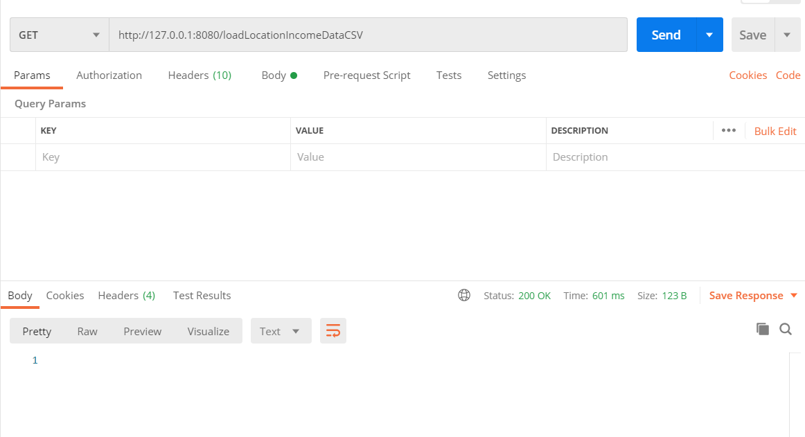
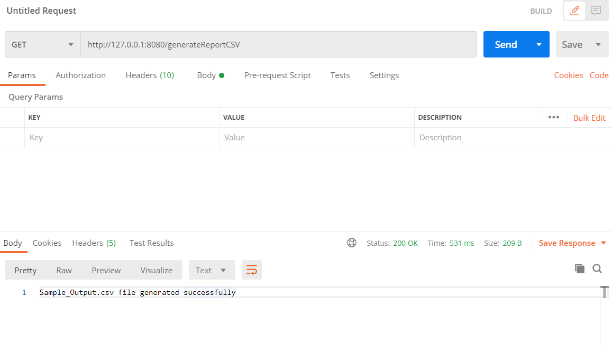

# IncomeEvaluator (Week 2 Assignment 3)

[](https://travis-ci.org/joemccann/dillinger)

Steps:
  - Create Postgresql database
  - Import this maven repo to workspace and then run
  - Postman API testing 
# Create Postgresql database
  - create database named income 
  - create table and lookup table using query tool
```sh
CREATE TABLE location_income(
	location_id SERIAL PRIMARY KEY,
	city VARCHAR(30),
	country VARCHAR(30),
	gender CHAR(1),
	currency CHAR(3),
	average_income NUMERIC
);
CREATE TABLE currency_usd_conversion(
	currency_id SERIAL PRIMARY KEY,
	currency CHAR(3),
	conversion_factor NUMERIC
);
INSERT INTO currency_usd_conversion(currency,conversion_factor)
VALUES ('INR',0.013),('GBP',1.31),('SGP',0.73),('HKD',0.13),('USD',1);
```
# Import this maven repo to workspace and then run
## command 1
```sh
mvn clean install
```
### Output
```console
C:\Users\STARK\Desktop\dev\incomeevaluator\incomeevaluator>mvn clean install
[INFO] Scanning for projects...
[INFO]
[INFO] --------------------< com.shashank:incomeevaluator >--------------------
[INFO] Building incomeevaluator 0.0.1-SNAPSHOT
[INFO] --------------------------------[ jar ]---------------------------------
[INFO]
[INFO] --- maven-clean-plugin:3.1.0:clean (default-clean) @ incomeevaluator ---
[INFO] Deleting C:\Users\STARK\Desktop\dev\incomeevaluator\incomeevaluator\target
[INFO]
[INFO] --- maven-resources-plugin:3.2.0:resources (default-resources) @ incomeevaluator ---
[INFO] Using 'UTF-8' encoding to copy filtered resources.
[INFO] Using 'UTF-8' encoding to copy filtered properties files.
[INFO] Copying 1 resource
[INFO] Copying 2 resources
[INFO] The encoding used to copy filtered properties files have not been set. This means that the same encoding will be used to copy filtered properties files as when copying other filtered resources. This might not be what you want! Run your build with --debug to see which files might be affected. Read more at https://maven.apache.org/plugins/maven-resources-plugin/examples/filtering-properties-files.html
[INFO]
[INFO] --- maven-compiler-plugin:3.2:compile (default-compile) @ incomeevaluator ---
[INFO] Changes detected - recompiling the module!
[INFO] Compiling 7 source files to C:\Users\STARK\Desktop\dev\incomeevaluator\incomeevaluator\target\classes
[INFO]
[INFO] --- maven-resources-plugin:3.2.0:testResources (default-testResources) @ incomeevaluator ---
[INFO] Using 'UTF-8' encoding to copy filtered resources.
[INFO] Using 'UTF-8' encoding to copy filtered properties files.
[INFO] skip non existing resourceDirectory C:\Users\STARK\Desktop\dev\incomeevaluator\incomeevaluator\src\test\resources
[INFO]
[INFO] --- maven-compiler-plugin:3.2:testCompile (default-testCompile) @ incomeevaluator ---
[INFO] Changes detected - recompiling the module!
[INFO] Compiling 1 source file to C:\Users\STARK\Desktop\dev\incomeevaluator\incomeevaluator\target\test-classes
[INFO]
[INFO] --- maven-surefire-plugin:2.22.2:test (default-test) @ incomeevaluator ---
[INFO]
[INFO] -------------------------------------------------------
[INFO]  T E S T S
[INFO] -------------------------------------------------------
[INFO] Running com.shashank.incomeevaluator.IncomeevaluatorApplicationTests
16:21:28.867 [main] DEBUG org.springframework.test.context.BootstrapUtils - Instantiating CacheAwareContextLoaderDelegate from class [org.springframework.test.context.cache.DefaultCacheAwareContextLoaderDelegate]
16:21:28.909 [main] DEBUG org.springframework.test.context.BootstrapUtils - Instantiating BootstrapContext using constructor [public org.springframework.test.context.support.DefaultBootstrapContext(java.lang.Class,org.springframework.test.context.CacheAwareContextLoaderDelegate)]
16:21:28.991 [main] DEBUG org.springframework.test.context.BootstrapUtils - Instantiating TestContextBootstrapper for test class [com.shashank.incomeevaluator.IncomeevaluatorApplicationTests] from class [org.springframework.boot.test.context.SpringBootTestContextBootstrapper]
16:21:29.037 [main] INFO org.springframework.boot.test.context.SpringBootTestContextBootstrapper - Neither @ContextConfiguration nor @ContextHierarchy found for test class [com.shashank.incomeevaluator.IncomeevaluatorApplicationTests], using SpringBootContextLoader
16:21:29.050 [main] DEBUG org.springframework.test.context.support.AbstractContextLoader - Did not detect default resource location for test class [com.shashank.incomeevaluator.IncomeevaluatorApplicationTests]: class path resource [com/shashank/incomeevaluator/IncomeevaluatorApplicationTests-context.xml] does not exist
16:21:29.051 [main] DEBUG org.springframework.test.context.support.AbstractContextLoader - Did not detect default resource location for test class [com.shashank.incomeevaluator.IncomeevaluatorApplicationTests]: class path resource [com/shashank/incomeevaluator/IncomeevaluatorApplicationTestsContext.groovy] does not exist
16:21:29.052 [main] INFO org.springframework.test.context.support.AbstractContextLoader - Could not detect default resource locations for test class [com.shashank.incomeevaluator.IncomeevaluatorApplicationTests]: no resource found for suffixes {-context.xml, Context.groovy}.
16:21:29.053 [main] INFO org.springframework.test.context.support.AnnotationConfigContextLoaderUtils - Could not detect default configuration classes for test class [com.shashank.incomeevaluator.IncomeevaluatorApplicationTests]: IncomeevaluatorApplicationTests does not declare any static, non-private, non-final, nested classes annotated with @Configuration.
16:21:29.185 [main] DEBUG org.springframework.test.context.support.ActiveProfilesUtils - Could not find an 'annotation declaring class' for annotation type [org.springframework.test.context.ActiveProfiles] and class [com.shashank.incomeevaluator.IncomeevaluatorApplicationTests]
16:21:29.366 [main] DEBUG org.springframework.context.annotation.ClassPathScanningCandidateComponentProvider - Identified candidate component class: file [C:\Users\STARK\Desktop\dev\incomeevaluator\incomeevaluator\target\classes\com\shashank\incomeevaluator\IncomeevaluatorApplication.class]
16:21:29.368 [main] INFO org.springframework.boot.test.context.SpringBootTestContextBootstrapper - Found @SpringBootConfiguration com.shashank.incomeevaluator.IncomeevaluatorApplication for test class com.shashank.incomeevaluator.IncomeevaluatorApplicationTests
16:21:29.681 [main] DEBUG org.springframework.boot.test.context.SpringBootTestContextBootstrapper - @TestExecutionListeners is not present for class [com.shashank.incomeevaluator.IncomeevaluatorApplicationTests]: using defaults.
16:21:29.682 [main] INFO org.springframework.boot.test.context.SpringBootTestContextBootstrapper - Loaded default TestExecutionListener class names from location [META-INF/spring.factories]: [org.springframework.boot.test.mock.mockito.MockitoTestExecutionListener, org.springframework.boot.test.mock.mockito.ResetMocksTestExecutionListener, org.springframework.boot.test.autoconfigure.restdocs.RestDocsTestExecutionListener, org.springframework.boot.test.autoconfigure.web.client.MockRestServiceServerResetTestExecutionListener, org.springframework.boot.test.autoconfigure.web.servlet.MockMvcPrintOnlyOnFailureTestExecutionListener, org.springframework.boot.test.autoconfigure.web.servlet.WebDriverTestExecutionListener, org.springframework.boot.test.autoconfigure.webservices.client.MockWebServiceServerTestExecutionListener, org.springframework.test.context.web.ServletTestExecutionListener, org.springframework.test.context.support.DirtiesContextBeforeModesTestExecutionListener, org.springframework.test.context.support.DependencyInjectionTestExecutionListener, org.springframework.test.context.support.DirtiesContextTestExecutionListener, org.springframework.test.context.transaction.TransactionalTestExecutionListener, org.springframework.test.context.jdbc.SqlScriptsTestExecutionListener, org.springframework.test.context.event.EventPublishingTestExecutionListener]
16:21:29.753 [main] INFO org.springframework.boot.test.context.SpringBootTestContextBootstrapper - Using TestExecutionListeners: [org.springframework.test.context.web.ServletTestExecutionListener@3d246ea3, org.springframework.test.context.support.DirtiesContextBeforeModesTestExecutionListener@341814d3, org.springframework.boot.test.mock.mockito.MockitoTestExecutionListener@4397ad89, org.springframework.boot.test.autoconfigure.SpringBootDependencyInjectionTestExecutionListener@59cba5a, org.springframework.test.context.support.DirtiesContextTestExecutionListener@1bd39d3c, org.springframework.test.context.transaction.TransactionalTestExecutionListener@6f19ac19, org.springframework.test.context.jdbc.SqlScriptsTestExecutionListener@119cbf96, org.springframework.test.context.event.EventPublishingTestExecutionListener@71329995, org.springframework.boot.test.mock.mockito.ResetMocksTestExecutionListener@768fc0f2, org.springframework.boot.test.autoconfigure.restdocs.RestDocsTestExecutionListener@5454d35e, org.springframework.boot.test.autoconfigure.web.client.MockRestServiceServerResetTestExecutionListener@20c0a64d, org.springframework.boot.test.autoconfigure.web.servlet.MockMvcPrintOnlyOnFailureTestExecutionListener@455b6df1, org.springframework.boot.test.autoconfigure.web.servlet.WebDriverTestExecutionListener@4ddbbdf8, org.springframework.boot.test.autoconfigure.webservices.client.MockWebServiceServerTestExecutionListener@3f67593e]
16:21:29.770 [main] DEBUG org.springframework.test.context.support.AbstractDirtiesContextTestExecutionListener - Before test class: context [DefaultTestContext@4b213651 testClass = IncomeevaluatorApplicationTests, testInstance = [null], testMethod = [null], testException = [null], mergedContextConfiguration = [WebMergedContextConfiguration@4241e0f4 testClass = IncomeevaluatorApplicationTests, locations = '{}', classes = '{class com.shashank.incomeevaluator.IncomeevaluatorApplication}', contextInitializerClasses = '[]', activeProfiles = '{}', propertySourceLocations = '{}', propertySourceProperties = '{org.springframework.boot.test.context.SpringBootTestContextBootstrapper=true}', contextCustomizers = set[org.springframework.boot.test.context.filter.ExcludeFilterContextCustomizer@72cde7cc, org.springframework.boot.test.json.DuplicateJsonObjectContextCustomizerFactory$DuplicateJsonObjectContextCustomizer@4e7912d8, org.springframework.boot.test.mock.mockito.MockitoContextCustomizer@0, org.springframework.boot.test.web.client.TestRestTemplateContextCustomizer@31e5415e, org.springframework.boot.test.autoconfigure.actuate.metrics.MetricsExportContextCustomizerFactory$DisableMetricExportContextCustomizer@15bbf42f, org.springframework.boot.test.autoconfigure.properties.PropertyMappingContextCustomizer@0, org.springframework.boot.test.autoconfigure.web.servlet.WebDriverContextCustomizerFactory$Customizer@2053d869, org.springframework.boot.test.context.SpringBootTestArgs@1], resourceBasePath = 'src/main/webapp', contextLoader = 'org.springframework.boot.test.context.SpringBootContextLoader', parent = [null]], attributes = map['org.springframework.test.context.web.ServletTestExecutionListener.activateListener' -> true]], class annotated with @DirtiesContext [false] with mode [null].
16:21:29.935 [main] DEBUG org.springframework.test.context.support.TestPropertySourceUtils - Adding inlined properties to environment: {spring.jmx.enabled=false, org.springframework.boot.test.context.SpringBootTestContextBootstrapper=true}

  .   ____          _            __ _ _
 /\\ / ___'_ __ _ _(_)_ __  __ _ \ \ \ \
( ( )\___ | '_ | '_| | '_ \/ _` | \ \ \ \
 \\/  ___)| |_)| | | | | || (_| |  ) ) ) )
  '  |____| .__|_| |_|_| |_\__, | / / / /
 =========|_|==============|___/=/_/_/_/
 :: Spring Boot ::       (v2.4.0-SNAPSHOT)

2020-08-26 16:21:31.454  INFO 14008 --- [           main] c.s.i.IncomeevaluatorApplicationTests    : Starting IncomeevaluatorApplicationTests using Java 14 on MSI with PID 14008 (started by STARK in C:\Users\STARK\Desktop\dev\incomeevaluator\incomeevaluator)
2020-08-26 16:21:31.469  INFO 14008 --- [           main] c.s.i.IncomeevaluatorApplicationTests    : No active profile set, falling back to default profiles: default
2020-08-26 16:21:34.384  INFO 14008 --- [           main] .s.d.r.c.RepositoryConfigurationDelegate : Bootstrapping Spring Data JPA repositories in DEFERRED mode.
2020-08-26 16:21:34.664  INFO 14008 --- [           main] .s.d.r.c.RepositoryConfigurationDelegate : Finished Spring Data repository scanning in 231 ms. Found 1 JPA repository interfaces.
2020-08-26 16:21:36.915  INFO 14008 --- [           main] o.s.s.concurrent.ThreadPoolTaskExecutor  : Initializing ExecutorService 'applicationTaskExecutor'
2020-08-26 16:21:37.339  INFO 14008 --- [         task-1] o.hibernate.jpa.internal.util.LogHelper  : HHH000204: Processing PersistenceUnitInfo [name: default]
2020-08-26 16:21:37.740  INFO 14008 --- [         task-1] org.hibernate.Version                    : HHH000412: Hibernate ORM core version 5.4.20.Final
2020-08-26 16:21:38.750  WARN 14008 --- [           main] JpaBaseConfiguration$JpaWebConfiguration : spring.jpa.open-in-view is enabled by default. Therefore, database queries may be performed during view rendering. Explicitly configure spring.jpa.open-in-view to disable this warning
2020-08-26 16:21:38.830  INFO 14008 --- [         task-1] o.hibernate.annotations.common.Version   : HCANN000001: Hibernate Commons Annotations {5.1.0.Final}
2020-08-26 16:21:39.830  INFO 14008 --- [         task-1] com.zaxxer.hikari.HikariDataSource       : HikariPool-1 - Starting...
2020-08-26 16:21:40.613  INFO 14008 --- [         task-1] com.zaxxer.hikari.HikariDataSource       : HikariPool-1 - Start completed.
2020-08-26 16:21:40.721  INFO 14008 --- [         task-1] org.hibernate.dialect.Dialect            : HHH000400: Using dialect: org.hibernate.dialect.PostgreSQLDialect
2020-08-26 16:21:42.626  INFO 14008 --- [           main] DeferredRepositoryInitializationListener : Triggering deferred initialization of Spring Data repositories?
2020-08-26 16:21:44.817  INFO 14008 --- [         task-1] o.h.e.t.j.p.i.JtaPlatformInitiator       : HHH000490: Using JtaPlatform implementation: [org.hibernate.engine.transaction.jta.platform.internal.NoJtaPlatform]
2020-08-26 16:21:44.843  INFO 14008 --- [         task-1] j.LocalContainerEntityManagerFactoryBean : Initialized JPA EntityManagerFactory for persistence unit 'default'
2020-08-26 16:21:45.301  INFO 14008 --- [           main] DeferredRepositoryInitializationListener : Spring Data repositories initialized!
2020-08-26 16:21:45.321  INFO 14008 --- [           main] c.s.i.IncomeevaluatorApplicationTests    : Started IncomeevaluatorApplicationTests in 15.355 seconds (JVM running for 18.659)
Hibernate: select currencyus0_.currency_id as currency1_0_, currencyus0_.conversion_factor as conversi2_0_, currencyus0_.currency as currency3_0_ from currency_usd_conversion currencyus0_
CurrencyUSDConversion [currency_id=1, currency=INR, conversion_factor=0.013]
CurrencyUSDConversion [currency_id=2, currency=GBP, conversion_factor=1.31]
CurrencyUSDConversion [currency_id=3, currency=SGP, conversion_factor=0.73]
CurrencyUSDConversion [currency_id=4, currency=HKD, conversion_factor=0.13]
CurrencyUSDConversion [currency_id=5, currency=USD, conversion_factor=1.0]
[CurrencyUSDConversion [currency_id=1, currency=INR, conversion_factor=0.013], CurrencyUSDConversion [currency_id=2, currency=GBP, conversion_factor=1.31], CurrencyUSDConversion [currency_id=3, currency=SGP, conversion_factor=0.73], CurrencyUSDConversion [currency_id=4, currency=HKD, conversion_factor=0.13], CurrencyUSDConversion [currency_id=5, currency=USD, conversion_factor=1.0]]
[INFO] Tests run: 1, Failures: 0, Errors: 0, Skipped: 0, Time elapsed: 17.96 s - in com.shashank.incomeevaluator.IncomeevaluatorApplicationTests
2020-08-26 16:21:46.819  INFO 14008 --- [extShutdownHook] j.LocalContainerEntityManagerFactoryBean : Closing JPA EntityManagerFactory for persistence unit 'default'
2020-08-26 16:21:46.826  INFO 14008 --- [extShutdownHook] o.s.s.concurrent.ThreadPoolTaskExecutor  : Shutting down ExecutorService 'applicationTaskExecutor'
2020-08-26 16:21:46.829  INFO 14008 --- [extShutdownHook] com.zaxxer.hikari.HikariDataSource       : HikariPool-1 - Shutdown initiated...
2020-08-26 16:21:46.865  INFO 14008 --- [extShutdownHook] com.zaxxer.hikari.HikariDataSource       : HikariPool-1 - Shutdown completed.
[INFO]
[INFO] Results:
[INFO]
[INFO] Tests run: 1, Failures: 0, Errors: 0, Skipped: 0
[INFO]
[INFO]
[INFO] --- maven-jar-plugin:3.2.0:jar (default-jar) @ incomeevaluator ---
[INFO] Building jar: C:\Users\STARK\Desktop\dev\incomeevaluator\incomeevaluator\target\incomeevaluator-0.0.1-SNAPSHOT.jar
[INFO]
[INFO] --- spring-boot-maven-plugin:2.4.0-SNAPSHOT:repackage (repackage) @ incomeevaluator ---
[INFO] Replacing main artifact with repackaged archive
[INFO]
[INFO] --- maven-install-plugin:2.5.2:install (default-install) @ incomeevaluator ---
[INFO] Installing C:\Users\STARK\Desktop\dev\incomeevaluator\incomeevaluator\target\incomeevaluator-0.0.1-SNAPSHOT.jar to C:\Users\STARK\.m2\repository\com\shashank\incomeevaluator\0.0.1-SNAPSHOT\incomeevaluator-0.0.1-SNAPSHOT.jar
[INFO] Installing C:\Users\STARK\Desktop\dev\incomeevaluator\incomeevaluator\pom.xml to C:\Users\STARK\.m2\repository\com\shashank\incomeevaluator\0.0.1-SNAPSHOT\incomeevaluator-0.0.1-SNAPSHOT.pom
[INFO] ------------------------------------------------------------------------
[INFO] BUILD SUCCESS
[INFO] ------------------------------------------------------------------------
[INFO] Total time:  38.596 s
[INFO] Finished at: 2020-08-26T16:21:50+05:30
[INFO] ------------------------------------------------------------------------
```
## command 2
```sh
mvn spring-boot:run
```
### Output
```console
C:\Users\STARK\Desktop\dev\incomeevaluator\incomeevaluator>mvn spring-boot:run
[INFO] Scanning for projects...
[INFO]
[INFO] --------------------< com.shashank:incomeevaluator >--------------------
[INFO] Building incomeevaluator 0.0.1-SNAPSHOT
[INFO] --------------------------------[ jar ]---------------------------------
[INFO]
[INFO] >>> spring-boot-maven-plugin:2.4.0-SNAPSHOT:run (default-cli) > test-compile @ incomeevaluator >>>
[INFO]
[INFO] --- maven-resources-plugin:3.2.0:resources (default-resources) @ incomeevaluator ---
[INFO] Using 'UTF-8' encoding to copy filtered resources.
[INFO] Using 'UTF-8' encoding to copy filtered properties files.
[INFO] Copying 1 resource
[INFO] Copying 2 resources
[INFO] The encoding used to copy filtered properties files have not been set. This means that the same encoding will be used to copy filtered properties files as when copying other filtered resources. This might not be what you want! Run your build with --debug to see which files might be affected. Read more at https://maven.apache.org/plugins/maven-resources-plugin/examples/filtering-properties-files.html
[INFO]
[INFO] --- maven-compiler-plugin:3.2:compile (default-compile) @ incomeevaluator ---
[INFO] Nothing to compile - all classes are up to date
[INFO]
[INFO] --- maven-resources-plugin:3.2.0:testResources (default-testResources) @ incomeevaluator ---
[INFO] Using 'UTF-8' encoding to copy filtered resources.
[INFO] Using 'UTF-8' encoding to copy filtered properties files.
[INFO] skip non existing resourceDirectory C:\Users\STARK\Desktop\dev\incomeevaluator\incomeevaluator\src\test\resources
[INFO]
[INFO] --- maven-compiler-plugin:3.2:testCompile (default-testCompile) @ incomeevaluator ---
[INFO] Nothing to compile - all classes are up to date
[INFO]
[INFO] <<< spring-boot-maven-plugin:2.4.0-SNAPSHOT:run (default-cli) < test-compile @ incomeevaluator <<<
[INFO]
[INFO]
[INFO] --- spring-boot-maven-plugin:2.4.0-SNAPSHOT:run (default-cli) @ incomeevaluator ---
[INFO] Attaching agents: []

  .   ____          _            __ _ _
 /\\ / ___'_ __ _ _(_)_ __  __ _ \ \ \ \
( ( )\___ | '_ | '_| | '_ \/ _` | \ \ \ \
 \\/  ___)| |_)| | | | | || (_| |  ) ) ) )
  '  |____| .__|_| |_|_| |_\__, | / / / /
 =========|_|==============|___/=/_/_/_/
 :: Spring Boot ::       (v2.4.0-SNAPSHOT)

2020-08-26 16:26:07.788  INFO 19984 --- [           main] c.s.i.IncomeevaluatorApplication         : Starting IncomeevaluatorApplication using Java 14 on MSI with PID 19984 (C:\Users\STARK\Desktop\dev\incomeevaluator\incomeevaluator\target\classes started by STARK in C:\Users\STARK\Desktop\dev\incomeevaluator\incomeevaluator)
2020-08-26 16:26:07.797  INFO 19984 --- [           main] c.s.i.IncomeevaluatorApplication         : No active profile set, falling back to default profiles: default
2020-08-26 16:26:09.136  INFO 19984 --- [           main] .s.d.r.c.RepositoryConfigurationDelegate : Bootstrapping Spring Data JPA repositories in DEFERRED mode.
2020-08-26 16:26:09.248  INFO 19984 --- [           main] .s.d.r.c.RepositoryConfigurationDelegate : Finished Spring Data repository scanning in 93 ms. Found 1 JPA repository interfaces.
2020-08-26 16:26:10.799  INFO 19984 --- [           main] o.s.b.w.embedded.tomcat.TomcatWebServer  : Tomcat initialized with port(s): 8080 (http)
2020-08-26 16:26:10.826  INFO 19984 --- [           main] o.apache.catalina.core.StandardService   : Starting service [Tomcat]
2020-08-26 16:26:10.828  INFO 19984 --- [           main] org.apache.catalina.core.StandardEngine  : Starting Servlet engine: [Apache Tomcat/9.0.37]
2020-08-26 16:26:11.124  INFO 19984 --- [           main] o.a.c.c.C.[Tomcat].[localhost].[/]       : Initializing Spring embedded WebApplicationContext
2020-08-26 16:26:11.126  INFO 19984 --- [           main] w.s.c.ServletWebServerApplicationContext : Root WebApplicationContext: initialization completed in 3220 ms
2020-08-26 16:26:11.711  INFO 19984 --- [           main] o.s.s.concurrent.ThreadPoolTaskExecutor  : Initializing ExecutorService 'applicationTaskExecutor'
2020-08-26 16:26:11.835  INFO 19984 --- [         task-1] o.hibernate.jpa.internal.util.LogHelper  : HHH000204: Processing PersistenceUnitInfo [name: default]
2020-08-26 16:26:12.018  WARN 19984 --- [           main] JpaBaseConfiguration$JpaWebConfiguration : spring.jpa.open-in-view is enabled by default. Therefore, database queries may be performed during view rendering. Explicitly configure spring.jpa.open-in-view to disable this warning
2020-08-26 16:26:12.101  INFO 19984 --- [         task-1] org.hibernate.Version                    : HHH000412: Hibernate ORM core version 5.4.20.Final
2020-08-26 16:26:12.498  INFO 19984 --- [         task-1] o.hibernate.annotations.common.Version   : HCANN000001: Hibernate Commons Annotations {5.1.0.Final}
2020-08-26 16:26:12.855  INFO 19984 --- [         task-1] com.zaxxer.hikari.HikariDataSource       : HikariPool-1 - Starting...
2020-08-26 16:26:13.368  INFO 19984 --- [         task-1] com.zaxxer.hikari.HikariDataSource       : HikariPool-1 - Start completed.
2020-08-26 16:26:13.448  INFO 19984 --- [           main] o.s.b.w.embedded.tomcat.TomcatWebServer  : Tomcat started on port(s): 8080 (http) with context path ''
2020-08-26 16:26:13.452  INFO 19984 --- [           main] DeferredRepositoryInitializationListener : Triggering deferred initialization of Spring Data repositoriesà
2020-08-26 16:26:13.467  INFO 19984 --- [         task-1] org.hibernate.dialect.Dialect            : HHH000400: Using dialect: org.hibernate.dialect.PostgreSQLDialect
2020-08-26 16:26:15.931  INFO 19984 --- [         task-1] o.h.e.t.j.p.i.JtaPlatformInitiator       : HHH000490: Using JtaPlatform implementation: [org.hibernate.engine.transaction.jta.platform.internal.NoJtaPlatform]
2020-08-26 16:26:15.948  INFO 19984 --- [         task-1] j.LocalContainerEntityManagerFactoryBean : Initialized JPA EntityManagerFactory for persistence unit 'default'
2020-08-26 16:26:16.437  INFO 19984 --- [           main] DeferredRepositoryInitializationListener : Spring Data repositories initialized!
2020-08-26 16:26:16.463  INFO 19984 --- [           main] c.s.i.IncomeevaluatorApplication         : Started IncomeevaluatorApplication in 9.614 seconds (JVM running for 10.479)
```

# Postman Api Testing
## API 1 for loading CVS data
```sh
http://127.0.0.1:8080/loadLocationIncomeDataCSV
```

## API 2 for generating country/city average income report
```sh
http://127.0.0.1:8080/generateReportCSV
```



