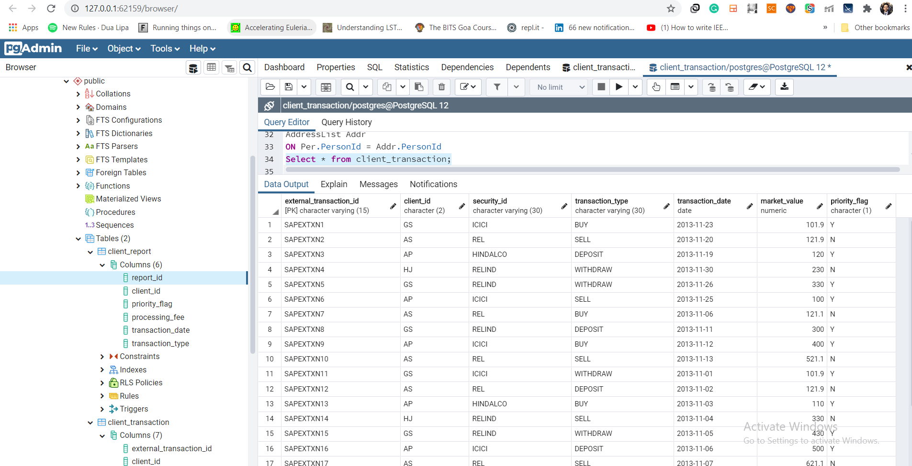

# IncomeEvaluator (Week 2 Assignment 2)

[](https://travis-ci.org/joemccann/dillinger)

Steps:
  - Create Postgresql database
  - Import this maven repo to workspace and then run
  - Postman API testing 
# Create Postgresql database
  - create database named income 
  - create table and lookup table using query tool
```sh
CREATE TABLE client_transaction(
	external_transaction_id VARCHAR(15) PRIMARY KEY,
	client_id CHAR(2),
  security_id VARCHAR(20),
  transaction_type VARCHAR(20),
  transaction_date DATE,
  market_value NUMERIC,
  priority_flag CHAR(1)
);
```
# Import this maven repo to workspace and then run
## command 1
```sh
mvn clean install
```
### Output
```console
C:\Users\STARK\eclipse-workspace2\fee_calculator>mvn clean install
[INFO] Scanning for projects...
[INFO]
[INFO] ---------------------< com.shashank:feecalculator >---------------------
[INFO] Building feecalculator 0.0.1-SNAPSHOT
[INFO] --------------------------------[ jar ]---------------------------------
Downloading from spring-milestones: https://repo.spring.io/milestone/org/springframework/boot/spring-boot-starter-data-jpa/2.4.0-SNAPSHOT/maven-metadata.xml
Downloading from spring-snapshots: https://repo.spring.io/snapshot/org/springframework/boot/spring-boot-starter-data-jpa/2.4.0-SNAPSHOT/maven-metadata.xml
Downloaded from spring-snapshots: https://repo.spring.io/snapshot/org/springframework/boot/spring-boot-starter-data-jpa/2.4.0-SNAPSHOT/maven-metadata.xml (1.4 kB at 819 B/s)
Downloading from spring-milestones: https://repo.spring.io/milestone/org/springframework/boot/spring-boot-starter-aop/2.4.0-SNAPSHOT/maven-metadata.xml
Downloading from spring-snapshots: https://repo.spring.io/snapshot/org/springframework/boot/spring-boot-starter-aop/2.4.0-SNAPSHOT/maven-metadata.xml
Downloaded from spring-snapshots: https://repo.spring.io/snapshot/org/springframework/boot/spring-boot-starter-aop/2.4.0-SNAPSHOT/maven-metadata.xml (1.4 kB at 1.1 kB/s)
Downloading from spring-milestones: https://repo.spring.io/milestone/org/springframework/boot/spring-boot-starter/2.4.0-SNAPSHOT/maven-metadata.xml
Downloading from spring-snapshots: https://repo.spring.io/snapshot/org/springframework/boot/spring-boot-starter/2.4.0-SNAPSHOT/maven-metadata.xml
Downloaded from spring-snapshots: https://repo.spring.io/snapshot/org/springframework/boot/spring-boot-starter/2.4.0-SNAPSHOT/maven-metadata.xml (1.4 kB at 1.1 kB/s)
Downloading from spring-milestones: https://repo.spring.io/milestone/org/springframework/boot/spring-boot/2.4.0-SNAPSHOT/maven-metadata.xml
Downloading from spring-snapshots: https://repo.spring.io/snapshot/org/springframework/boot/spring-boot/2.4.0-SNAPSHOT/maven-metadata.xml
Downloaded from spring-snapshots: https://repo.spring.io/snapshot/org/springframework/boot/spring-boot/2.4.0-SNAPSHOT/maven-metadata.xml (1.4 kB at 904 B/s)
Downloading from spring-milestones: https://repo.spring.io/milestone/org/springframework/boot/spring-boot-autoconfigure/2.4.0-SNAPSHOT/maven-metadata.xml
Downloading from spring-snapshots: https://repo.spring.io/snapshot/org/springframework/boot/spring-boot-autoconfigure/2.4.0-SNAPSHOT/maven-metadata.xml
Downloaded from spring-snapshots: https://repo.spring.io/snapshot/org/springframework/boot/spring-boot-autoconfigure/2.4.0-SNAPSHOT/maven-metadata.xml (1.4 kB at 1.1 kB/s)
Downloading from spring-milestones: https://repo.spring.io/milestone/org/springframework/boot/spring-boot-starter-logging/2.4.0-SNAPSHOT/maven-metadata.xml
Downloading from spring-snapshots: https://repo.spring.io/snapshot/org/springframework/boot/spring-boot-starter-logging/2.4.0-SNAPSHOT/maven-metadata.xml
Downloaded from spring-snapshots: https://repo.spring.io/snapshot/org/springframework/boot/spring-boot-starter-logging/2.4.0-SNAPSHOT/maven-metadata.xml (1.4 kB at 1.1 kB/s)
Downloading from spring-milestones: https://repo.spring.io/milestone/org/springframework/boot/spring-boot-starter-jdbc/2.4.0-SNAPSHOT/maven-metadata.xml
Downloading from spring-snapshots: https://repo.spring.io/snapshot/org/springframework/boot/spring-boot-starter-jdbc/2.4.0-SNAPSHOT/maven-metadata.xml
Downloaded from spring-snapshots: https://repo.spring.io/snapshot/org/springframework/boot/spring-boot-starter-jdbc/2.4.0-SNAPSHOT/maven-metadata.xml (1.4 kB at 1.3 kB/s)
Downloading from spring-snapshots: https://repo.spring.io/snapshot/org/springframework/boot/spring-boot-starter-web/2.4.0-SNAPSHOT/maven-metadata.xml
Downloading from spring-milestones: https://repo.spring.io/milestone/org/springframework/boot/spring-boot-starter-web/2.4.0-SNAPSHOT/maven-metadata.xml
Downloaded from spring-snapshots: https://repo.spring.io/snapshot/org/springframework/boot/spring-boot-starter-web/2.4.0-SNAPSHOT/maven-metadata.xml (1.4 kB at 1.1 kB/s)
Downloading from spring-milestones: https://repo.spring.io/milestone/org/springframework/boot/spring-boot-starter-json/2.4.0-SNAPSHOT/maven-metadata.xml
Downloading from spring-snapshots: https://repo.spring.io/snapshot/org/springframework/boot/spring-boot-starter-json/2.4.0-SNAPSHOT/maven-metadata.xml
Downloaded from spring-snapshots: https://repo.spring.io/snapshot/org/springframework/boot/spring-boot-starter-json/2.4.0-SNAPSHOT/maven-metadata.xml (1.4 kB at 1.2 kB/s)
Downloading from spring-snapshots: https://repo.spring.io/snapshot/org/springframework/boot/spring-boot-starter-tomcat/2.4.0-SNAPSHOT/maven-metadata.xml
Downloading from spring-milestones: https://repo.spring.io/milestone/org/springframework/boot/spring-boot-starter-tomcat/2.4.0-SNAPSHOT/maven-metadata.xml
Downloaded from spring-snapshots: https://repo.spring.io/snapshot/org/springframework/boot/spring-boot-starter-tomcat/2.4.0-SNAPSHOT/maven-metadata.xml (1.4 kB at 989 B/s)
Downloading from spring-milestones: https://repo.spring.io/milestone/org/springframework/boot/spring-boot-starter-test/2.4.0-SNAPSHOT/maven-metadata.xml
Downloading from spring-snapshots: https://repo.spring.io/snapshot/org/springframework/boot/spring-boot-starter-test/2.4.0-SNAPSHOT/maven-metadata.xml
Downloaded from spring-snapshots: https://repo.spring.io/snapshot/org/springframework/boot/spring-boot-starter-test/2.4.0-SNAPSHOT/maven-metadata.xml (1.4 kB at 1.2 kB/s)
Downloading from spring-milestones: https://repo.spring.io/milestone/org/springframework/boot/spring-boot-test/2.4.0-SNAPSHOT/maven-metadata.xml
Downloading from spring-snapshots: https://repo.spring.io/snapshot/org/springframework/boot/spring-boot-test/2.4.0-SNAPSHOT/maven-metadata.xml
Downloaded from spring-snapshots: https://repo.spring.io/snapshot/org/springframework/boot/spring-boot-test/2.4.0-SNAPSHOT/maven-metadata.xml (1.4 kB at 1.2 kB/s)
Downloading from spring-snapshots: https://repo.spring.io/snapshot/org/springframework/boot/spring-boot-test-autoconfigure/2.4.0-SNAPSHOT/maven-metadata.xml
Downloading from spring-milestones: https://repo.spring.io/milestone/org/springframework/boot/spring-boot-test-autoconfigure/2.4.0-SNAPSHOT/maven-metadata.xml
Downloaded from spring-snapshots: https://repo.spring.io/snapshot/org/springframework/boot/spring-boot-test-autoconfigure/2.4.0-SNAPSHOT/maven-metadata.xml (1.4 kB at 1.0 kB/s)
[INFO]
[INFO] --- maven-clean-plugin:3.1.0:clean (default-clean) @ feecalculator ---
[INFO]
[INFO] --- maven-resources-plugin:3.2.0:resources (default-resources) @ feecalculator ---
[INFO] Using 'UTF-8' encoding to copy filtered resources.
[INFO] Using 'UTF-8' encoding to copy filtered properties files.
[INFO] Copying 1 resource
[INFO] Copying 2 resources
[INFO] The encoding used to copy filtered properties files have not been set. This means that the same encoding will be used to copy filtered properties files as when copying other filtered resources. This might not be what you want! Run your build with --debug to see which files might be affected. Read more at https://maven.apache.org/plugins/maven-resources-plugin/examples/filtering-properties-files.html
[INFO]
[INFO] --- maven-compiler-plugin:3.2:compile (default-compile) @ feecalculator ---
[INFO] Changes detected - recompiling the module!
[INFO] Compiling 7 source files to C:\Users\STARK\eclipse-workspace2\fee_calculator\target\classes
[INFO]
[INFO] --- maven-resources-plugin:3.2.0:testResources (default-testResources) @ feecalculator ---
[INFO] Using 'UTF-8' encoding to copy filtered resources.
[INFO] Using 'UTF-8' encoding to copy filtered properties files.
[INFO] skip non existing resourceDirectory C:\Users\STARK\eclipse-workspace2\fee_calculator\src\test\resources
[INFO]
[INFO] --- maven-compiler-plugin:3.2:testCompile (default-testCompile) @ feecalculator ---
[INFO] Changes detected - recompiling the module!
[INFO] Compiling 1 source file to C:\Users\STARK\eclipse-workspace2\fee_calculator\target\test-classes
[INFO]
[INFO] --- maven-surefire-plugin:2.22.2:test (default-test) @ feecalculator ---
[INFO]
[INFO] -------------------------------------------------------
[INFO]  T E S T S
[INFO] -------------------------------------------------------
[INFO] Running com.shashank.feecalculator.FeeCalculatorApplicationTests
00:29:00.326 [main] DEBUG org.springframework.test.context.BootstrapUtils - Instantiating CacheAwareContextLoaderDelegate from class [org.springframework.test.context.cache.DefaultCacheAwareContextLoaderDelegate]
00:29:00.355 [main] DEBUG org.springframework.test.context.BootstrapUtils - Instantiating BootstrapContext using constructor [public org.springframework.test.context.support.DefaultBootstrapContext(java.lang.Class,org.springframework.test.context.CacheAwareContextLoaderDelegate)]
00:29:00.437 [main] DEBUG org.springframework.test.context.BootstrapUtils - Instantiating TestContextBootstrapper for test class [com.shashank.feecalculator.FeeCalculatorApplicationTests] from class [org.springframework.boot.test.context.SpringBootTestContextBootstrapper]
00:29:00.479 [main] INFO org.springframework.boot.test.context.SpringBootTestContextBootstrapper - Neither @ContextConfiguration nor @ContextHierarchy found for test class [com.shashank.feecalculator.FeeCalculatorApplicationTests], using SpringBootContextLoader
00:29:00.492 [main] DEBUG org.springframework.test.context.support.AbstractContextLoader - Did not detect default resource location for test class [com.shashank.feecalculator.FeeCalculatorApplicationTests]: class path resource [com/shashank/feecalculator/FeeCalculatorApplicationTests-context.xml] does not exist
00:29:00.494 [main] DEBUG org.springframework.test.context.support.AbstractContextLoader - Did not detect default resource location for test class [com.shashank.feecalculator.FeeCalculatorApplicationTests]: class path resource [com/shashank/feecalculator/FeeCalculatorApplicationTestsContext.groovy] does not exist
00:29:00.494 [main] INFO org.springframework.test.context.support.AbstractContextLoader - Could not detect default resource locations for test class [com.shashank.feecalculator.FeeCalculatorApplicationTests]: no resource found for suffixes {-context.xml, Context.groovy}.
00:29:00.495 [main] INFO org.springframework.test.context.support.AnnotationConfigContextLoaderUtils - Could not detect default configuration classes for test class [com.shashank.feecalculator.FeeCalculatorApplicationTests]: FeeCalculatorApplicationTests does not declare any static, non-private, non-final, nested classes annotated with @Configuration.
00:29:00.617 [main] DEBUG org.springframework.test.context.support.ActiveProfilesUtils - Could not find an 'annotation declaring class' for annotation type [org.springframework.test.context.ActiveProfiles] and class [com.shashank.feecalculator.FeeCalculatorApplicationTests]
00:29:00.812 [main] DEBUG org.springframework.context.annotation.ClassPathScanningCandidateComponentProvider - Identified candidate component class: file [C:\Users\STARK\eclipse-workspace2\fee_calculator\target\classes\com\shashank\feecalculator\FeeCalculatorApplication.class]
00:29:00.814 [main] INFO org.springframework.boot.test.context.SpringBootTestContextBootstrapper - Found @SpringBootConfiguration com.shashank.feecalculator.FeeCalculatorApplication for test class com.shashank.feecalculator.FeeCalculatorApplicationTests
00:29:01.043 [main] DEBUG org.springframework.boot.test.context.SpringBootTestContextBootstrapper - @TestExecutionListeners is not present for class [com.shashank.feecalculator.FeeCalculatorApplicationTests]: using defaults.
00:29:01.044 [main] INFO org.springframework.boot.test.context.SpringBootTestContextBootstrapper - Loaded default TestExecutionListener class names from location [META-INF/spring.factories]: [org.springframework.boot.test.mock.mockito.MockitoTestExecutionListener, org.springframework.boot.test.mock.mockito.ResetMocksTestExecutionListener, org.springframework.boot.test.autoconfigure.restdocs.RestDocsTestExecutionListener, org.springframework.boot.test.autoconfigure.web.client.MockRestServiceServerResetTestExecutionListener, org.springframework.boot.test.autoconfigure.web.servlet.MockMvcPrintOnlyOnFailureTestExecutionListener, org.springframework.boot.test.autoconfigure.web.servlet.WebDriverTestExecutionListener, org.springframework.boot.test.autoconfigure.webservices.client.MockWebServiceServerTestExecutionListener, org.springframework.test.context.web.ServletTestExecutionListener, org.springframework.test.context.support.DirtiesContextBeforeModesTestExecutionListener, org.springframework.test.context.support.DependencyInjectionTestExecutionListener, org.springframework.test.context.support.DirtiesContextTestExecutionListener, org.springframework.test.context.transaction.TransactionalTestExecutionListener, org.springframework.test.context.jdbc.SqlScriptsTestExecutionListener, org.springframework.test.context.event.EventPublishingTestExecutionListener]
00:29:01.093 [main] INFO org.springframework.boot.test.context.SpringBootTestContextBootstrapper - Using TestExecutionListeners: [org.springframework.test.context.web.ServletTestExecutionListener@3d246ea3, org.springframework.test.context.support.DirtiesContextBeforeModesTestExecutionListener@341814d3, org.springframework.boot.test.mock.mockito.MockitoTestExecutionListener@4397ad89, org.springframework.boot.test.autoconfigure.SpringBootDependencyInjectionTestExecutionListener@59cba5a, org.springframework.test.context.support.DirtiesContextTestExecutionListener@1bd39d3c, org.springframework.test.context.transaction.TransactionalTestExecutionListener@6f19ac19, org.springframework.test.context.jdbc.SqlScriptsTestExecutionListener@119cbf96, org.springframework.test.context.event.EventPublishingTestExecutionListener@71329995, org.springframework.boot.test.mock.mockito.ResetMocksTestExecutionListener@768fc0f2, org.springframework.boot.test.autoconfigure.restdocs.RestDocsTestExecutionListener@5454d35e, org.springframework.boot.test.autoconfigure.web.client.MockRestServiceServerResetTestExecutionListener@20c0a64d, org.springframework.boot.test.autoconfigure.web.servlet.MockMvcPrintOnlyOnFailureTestExecutionListener@455b6df1, org.springframework.boot.test.autoconfigure.web.servlet.WebDriverTestExecutionListener@4ddbbdf8, org.springframework.boot.test.autoconfigure.webservices.client.MockWebServiceServerTestExecutionListener@3f67593e]
00:29:01.103 [main] DEBUG org.springframework.test.context.support.AbstractDirtiesContextTestExecutionListener - Before test class: context [DefaultTestContext@4b213651 testClass = FeeCalculatorApplicationTests, testInstance = [null], testMethod = [null], testException = [null], mergedContextConfiguration = [WebMergedContextConfiguration@4241e0f4 testClass = FeeCalculatorApplicationTests, locations = '{}', classes = '{class com.shashank.feecalculator.FeeCalculatorApplication}', contextInitializerClasses = '[]', activeProfiles = '{}', propertySourceLocations = '{}', propertySourceProperties = '{org.springframework.boot.test.context.SpringBootTestContextBootstrapper=true}', contextCustomizers = set[org.springframework.boot.test.context.filter.ExcludeFilterContextCustomizer@72cde7cc, org.springframework.boot.test.json.DuplicateJsonObjectContextCustomizerFactory$DuplicateJsonObjectContextCustomizer@4e7912d8, org.springframework.boot.test.mock.mockito.MockitoContextCustomizer@0, org.springframework.boot.test.web.client.TestRestTemplateContextCustomizer@31e5415e, org.springframework.boot.test.autoconfigure.actuate.metrics.MetricsExportContextCustomizerFactory$DisableMetricExportContextCustomizer@15bbf42f, org.springframework.boot.test.autoconfigure.properties.PropertyMappingContextCustomizer@0, org.springframework.boot.test.autoconfigure.web.servlet.WebDriverContextCustomizerFactory$Customizer@2053d869, org.springframework.boot.test.context.SpringBootTestArgs@1], resourceBasePath = 'src/main/webapp', contextLoader = 'org.springframework.boot.test.context.SpringBootContextLoader', parent = [null]], attributes = map['org.springframework.test.context.web.ServletTestExecutionListener.activateListener' -> true]], class annotated with @DirtiesContext [false] with mode [null].
00:29:01.184 [main] DEBUG org.springframework.test.context.support.TestPropertySourceUtils - Adding inlined properties to environment: {spring.jmx.enabled=false, org.springframework.boot.test.context.SpringBootTestContextBootstrapper=true}

  .   ____          _            __ _ _
 /\\ / ___'_ __ _ _(_)_ __  __ _ \ \ \ \
( ( )\___ | '_ | '_| | '_ \/ _` | \ \ \ \
 \\/  ___)| |_)| | | | | || (_| |  ) ) ) )
  '  |____| .__|_| |_|_| |_\__, | / / / /
 =========|_|==============|___/=/_/_/_/
 :: Spring Boot ::       (v2.4.0-SNAPSHOT)

2020-08-31 00:29:02.152  INFO 22396 --- [           main] c.s.f.FeeCalculatorApplicationTests      : Starting FeeCalculatorApplicationTests using Java 14 on MSI with PID 22396 (started by STARK in C:\Users\STARK\eclipse-workspace2\fee_calculator)
2020-08-31 00:29:02.158  INFO 22396 --- [           main] c.s.f.FeeCalculatorApplicationTests      : No active profile set, falling back to default profiles: default
2020-08-31 00:29:03.861  INFO 22396 --- [           main] .s.d.r.c.RepositoryConfigurationDelegate : Bootstrapping Spring Data JPA repositories in DEFERRED mode.
2020-08-31 00:29:04.011  INFO 22396 --- [           main] .s.d.r.c.RepositoryConfigurationDelegate : Finished Spring Data repository scanning in 129 ms. Found 2 JPA repository interfaces.
2020-08-31 00:29:05.290  INFO 22396 --- [           main] o.s.s.concurrent.ThreadPoolTaskExecutor  : Initializing ExecutorService 'applicationTaskExecutor'
2020-08-31 00:29:05.506  INFO 22396 --- [         task-1] o.hibernate.jpa.internal.util.LogHelper  : HHH000204: Processing PersistenceUnitInfo [name: default]
2020-08-31 00:29:05.714  INFO 22396 --- [         task-1] org.hibernate.Version                    : HHH000412: Hibernate ORM core version 5.4.20.Final
2020-08-31 00:29:06.228  INFO 22396 --- [         task-1] o.hibernate.annotations.common.Version   : HCANN000001: Hibernate Commons Annotations {5.1.0.Final}
2020-08-31 00:29:06.350  WARN 22396 --- [           main] JpaBaseConfiguration$JpaWebConfiguration : spring.jpa.open-in-view is enabled by default. Therefore, database queries may be performed during view rendering. Explicitly configure spring.jpa.open-in-view to disable this warning
2020-08-31 00:29:06.752  INFO 22396 --- [         task-1] com.zaxxer.hikari.HikariDataSource       : HikariPool-1 - Starting...
2020-08-31 00:29:07.292  INFO 22396 --- [         task-1] com.zaxxer.hikari.HikariDataSource       : HikariPool-1 - Start completed.
2020-08-31 00:29:07.378  INFO 22396 --- [         task-1] org.hibernate.dialect.Dialect            : HHH000400: Using dialect: org.hibernate.dialect.PostgreSQLDialect
2020-08-31 00:29:08.438  INFO 22396 --- [           main] DeferredRepositoryInitializationListener : Triggering deferred initialization of Spring Data repositories?
2020-08-31 00:29:10.254  INFO 22396 --- [         task-1] o.h.e.t.j.p.i.JtaPlatformInitiator       : HHH000490: Using JtaPlatform implementation: [org.hibernate.engine.transaction.jta.platform.internal.NoJtaPlatform]
2020-08-31 00:29:10.277  INFO 22396 --- [         task-1] j.LocalContainerEntityManagerFactoryBean : Initialized JPA EntityManagerFactory for persistence unit 'default'
2020-08-31 00:29:10.757  INFO 22396 --- [           main] DeferredRepositoryInitializationListener : Spring Data repositories initialized!
2020-08-31 00:29:10.783  INFO 22396 --- [           main] c.s.f.FeeCalculatorApplicationTests      : Started FeeCalculatorApplicationTests in 9.579 seconds (JVM running for 11.94)
[INFO] Tests run: 1, Failures: 0, Errors: 0, Skipped: 0, Time elapsed: 11.122 s - in com.shashank.feecalculator.FeeCalculatorApplicationTests
2020-08-31 00:29:11.416  INFO 22396 --- [extShutdownHook] j.LocalContainerEntityManagerFactoryBean : Closing JPA EntityManagerFactory for persistence unit 'default'
2020-08-31 00:29:11.424  INFO 22396 --- [extShutdownHook] o.s.s.concurrent.ThreadPoolTaskExecutor  : Shutting down ExecutorService 'applicationTaskExecutor'
2020-08-31 00:29:11.426  INFO 22396 --- [extShutdownHook] com.zaxxer.hikari.HikariDataSource       : HikariPool-1 - Shutdown initiated...
2020-08-31 00:29:11.447  INFO 22396 --- [extShutdownHook] com.zaxxer.hikari.HikariDataSource       : HikariPool-1 - Shutdown completed.
[INFO]
[INFO] Results:
[INFO]
[INFO] Tests run: 1, Failures: 0, Errors: 0, Skipped: 0
[INFO]
[INFO]
[INFO] --- maven-jar-plugin:3.2.0:jar (default-jar) @ feecalculator ---
[INFO] Building jar: C:\Users\STARK\eclipse-workspace2\fee_calculator\target\feecalculator-0.0.1-SNAPSHOT.jar
[INFO]
[INFO] --- spring-boot-maven-plugin:2.4.0-SNAPSHOT:repackage (repackage) @ feecalculator ---
Downloading from spring-snapshots: https://repo.spring.io/snapshot/org/springframework/boot/spring-boot-buildpack-platform/2.4.0-SNAPSHOT/maven-metadata.xml
Downloading from spring-milestones: https://repo.spring.io/milestone/org/springframework/boot/spring-boot-buildpack-platform/2.4.0-SNAPSHOT/maven-metadata.xml
Downloaded from spring-snapshots: https://repo.spring.io/snapshot/org/springframework/boot/spring-boot-buildpack-platform/2.4.0-SNAPSHOT/maven-metadata.xml (1.4 kB at 1.5 kB/s)
Downloading from spring-milestones: https://repo.spring.io/milestone/org/springframework/boot/spring-boot-loader-tools/2.4.0-SNAPSHOT/maven-metadata.xml
Downloading from spring-snapshots: https://repo.spring.io/snapshot/org/springframework/boot/spring-boot-loader-tools/2.4.0-SNAPSHOT/maven-metadata.xml
Downloaded from spring-snapshots: https://repo.spring.io/snapshot/org/springframework/boot/spring-boot-loader-tools/2.4.0-SNAPSHOT/maven-metadata.xml (1.4 kB at 1.3 kB/s)
[INFO] Replacing main artifact with repackaged archive
[INFO]
[INFO] --- maven-install-plugin:2.5.2:install (default-install) @ feecalculator ---
[INFO] Installing C:\Users\STARK\eclipse-workspace2\fee_calculator\target\feecalculator-0.0.1-SNAPSHOT.jar to C:\Users\STARK\.m2\repository\com\shashank\feecalculator\0.0.1-SNAPSHOT\feecalculator-0.0.1-SNAPSHOT.jar
[INFO] Installing C:\Users\STARK\eclipse-workspace2\fee_calculator\pom.xml to C:\Users\STARK\.m2\repository\com\shashank\feecalculator\0.0.1-SNAPSHOT\feecalculator-0.0.1-SNAPSHOT.pom
[INFO] ------------------------------------------------------------------------
[INFO] BUILD SUCCESS
[INFO] ------------------------------------------------------------------------
[INFO] Total time:  47.555 s
[INFO] Finished at: 2020-08-31T00:29:17+05:30
[INFO] ------------------------------------------------------------------------
```
## command 2
```sh
mvn spring-boot:run
```
### Output
```console
C:\Users\STARK\eclipse-workspace2\fee_calculator>mvn spring-boot:run
[INFO] Scanning for projects...
[INFO]
[INFO] ---------------------< com.shashank:feecalculator >---------------------
[INFO] Building feecalculator 0.0.1-SNAPSHOT
[INFO] --------------------------------[ jar ]---------------------------------
[INFO]
[INFO] >>> spring-boot-maven-plugin:2.4.0-SNAPSHOT:run (default-cli) > test-compile @ feecalculator >>>
[INFO]
[INFO] --- maven-resources-plugin:3.2.0:resources (default-resources) @ feecalculator ---
[INFO] Using 'UTF-8' encoding to copy filtered resources.
[INFO] Using 'UTF-8' encoding to copy filtered properties files.
[INFO] Copying 1 resource
[INFO] Copying 2 resources
[INFO] The encoding used to copy filtered properties files have not been set. This means that the same encoding will be used to copy filtered properties files as when copying other filtered resources. This might not be what you want! Run your build with --debug to see which files might be affected. Read more at https://maven.apache.org/plugins/maven-resources-plugin/examples/filtering-properties-files.html
[INFO]
[INFO] --- maven-compiler-plugin:3.2:compile (default-compile) @ feecalculator ---
[INFO] Nothing to compile - all classes are up to date
[INFO]
[INFO] --- maven-resources-plugin:3.2.0:testResources (default-testResources) @ feecalculator ---
[INFO] Using 'UTF-8' encoding to copy filtered resources.
[INFO] Using 'UTF-8' encoding to copy filtered properties files.
[INFO] skip non existing resourceDirectory C:\Users\STARK\eclipse-workspace2\fee_calculator\src\test\resources
[INFO]
[INFO] --- maven-compiler-plugin:3.2:testCompile (default-testCompile) @ feecalculator ---
[INFO] Nothing to compile - all classes are up to date
[INFO]
[INFO] <<< spring-boot-maven-plugin:2.4.0-SNAPSHOT:run (default-cli) < test-compile @ feecalculator <<<
[INFO]
[INFO]
[INFO] --- spring-boot-maven-plugin:2.4.0-SNAPSHOT:run (default-cli) @ feecalculator ---
[INFO] Attaching agents: []

  .   ____          _            __ _ _
 /\\ / ___'_ __ _ _(_)_ __  __ _ \ \ \ \
( ( )\___ | '_ | '_| | '_ \/ _` | \ \ \ \
 \\/  ___)| |_)| | | | | || (_| |  ) ) ) )
  '  |____| .__|_| |_|_| |_\__, | / / / /
 =========|_|==============|___/=/_/_/_/
 :: Spring Boot ::       (v2.4.0-SNAPSHOT)

2020-08-31 00:29:58.585  INFO 23448 --- [           main] c.s.f.FeeCalculatorApplication           : Starting FeeCalculatorApplication using Java 14 on MSI with PID 23448 (C:\Users\STARK\eclipse-workspace2\fee_calculator\target\classes started by STARK in C:\Users\STARK\eclipse-workspace2\fee_calculator)
2020-08-31 00:29:58.590  INFO 23448 --- [           main] c.s.f.FeeCalculatorApplication           : No active profile set, falling back to default profiles: default
2020-08-31 00:29:59.731  INFO 23448 --- [           main] .s.d.r.c.RepositoryConfigurationDelegate : Bootstrapping Spring Data JPA repositories in DEFERRED mode.
2020-08-31 00:29:59.857  INFO 23448 --- [           main] .s.d.r.c.RepositoryConfigurationDelegate : Finished Spring Data repository scanning in 107 ms. Found 2 JPA repository interfaces.
2020-08-31 00:30:01.055  INFO 23448 --- [           main] o.s.b.w.embedded.tomcat.TomcatWebServer  : Tomcat initialized with port(s): 8080 (http)
2020-08-31 00:30:01.080  INFO 23448 --- [           main] o.apache.catalina.core.StandardService   : Starting service [Tomcat]
2020-08-31 00:30:01.081  INFO 23448 --- [           main] org.apache.catalina.core.StandardEngine  : Starting Servlet engine: [Apache Tomcat/9.0.37]
2020-08-31 00:30:01.315  INFO 23448 --- [           main] o.a.c.c.C.[Tomcat].[localhost].[/]       : Initializing Spring embedded WebApplicationContext
2020-08-31 00:30:01.315  INFO 23448 --- [           main] w.s.c.ServletWebServerApplicationContext : Root WebApplicationContext: initialization completed in 2626 ms
2020-08-31 00:30:01.769  INFO 23448 --- [           main] o.s.s.concurrent.ThreadPoolTaskExecutor  : Initializing ExecutorService 'applicationTaskExecutor'
2020-08-31 00:30:01.871  INFO 23448 --- [         task-1] o.hibernate.jpa.internal.util.LogHelper  : HHH000204: Processing PersistenceUnitInfo [name: default]
2020-08-31 00:30:02.008  INFO 23448 --- [         task-1] org.hibernate.Version                    : HHH000412: Hibernate ORM core version 5.4.20.Final
2020-08-31 00:30:02.071  WARN 23448 --- [           main] JpaBaseConfiguration$JpaWebConfiguration : spring.jpa.open-in-view is enabled by default. Therefore, database queries may be performed during view rendering. Explicitly configure spring.jpa.open-in-view to disable this warning
2020-08-31 00:30:02.302  INFO 23448 --- [         task-1] o.hibernate.annotations.common.Version   : HCANN000001: Hibernate Commons Annotations {5.1.0.Final}
2020-08-31 00:30:02.528  INFO 23448 --- [         task-1] com.zaxxer.hikari.HikariDataSource       : HikariPool-1 - Starting...
2020-08-31 00:30:02.837  INFO 23448 --- [         task-1] com.zaxxer.hikari.HikariDataSource       : HikariPool-1 - Start completed.
2020-08-31 00:30:02.889  INFO 23448 --- [         task-1] org.hibernate.dialect.Dialect            : HHH000400: Using dialect: org.hibernate.dialect.PostgreSQLDialect
2020-08-31 00:30:03.127  INFO 23448 --- [           main] o.s.b.w.embedded.tomcat.TomcatWebServer  : Tomcat started on port(s): 8080 (http) with context path ''
2020-08-31 00:30:03.134  INFO 23448 --- [           main] DeferredRepositoryInitializationListener : Triggering deferred initialization of Spring Data repositoriesà
2020-08-31 00:30:04.744  INFO 23448 --- [         task-1] o.h.e.t.j.p.i.JtaPlatformInitiator       : HHH000490: Using JtaPlatform implementation: [org.hibernate.engine.transaction.jta.platform.internal.NoJtaPlatform]
2020-08-31 00:30:04.758  INFO 23448 --- [         task-1] j.LocalContainerEntityManagerFactoryBean : Initialized JPA EntityManagerFactory for persistence unit 'default'
2020-08-31 00:30:05.074  INFO 23448 --- [           main] DeferredRepositoryInitializationListener : Spring Data repositories initialized!
2020-08-31 00:30:05.092  INFO 23448 --- [           main] c.s.f.FeeCalculatorApplication           : Started FeeCalculatorApplication in 7.332 seconds (JVM running for 8.114)
```

# Postman Api Testing
## API 1 for loading CVS data
```sh
http://127.0.0.1:8080/loadClientTransactionData/csv
```


## data inside database


## API 2 for generating processing fee report
```sh
http://127.0.0.1:8080/generateReport/csv
```


## Logging of API requests


